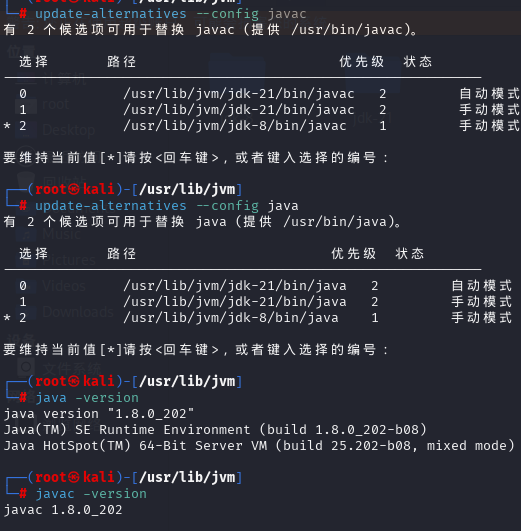
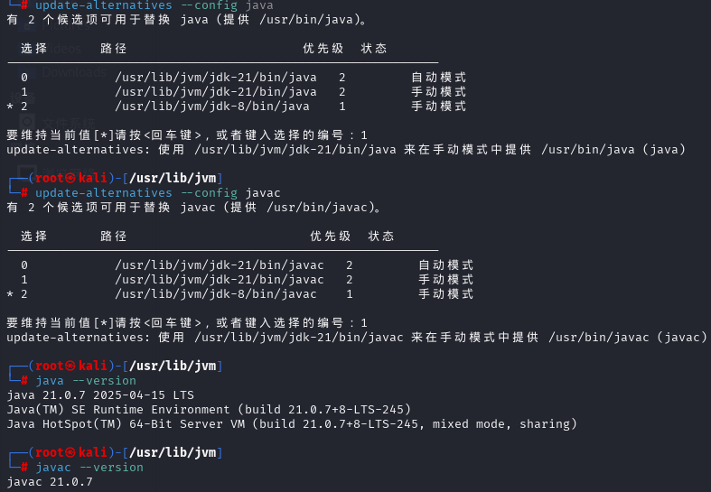
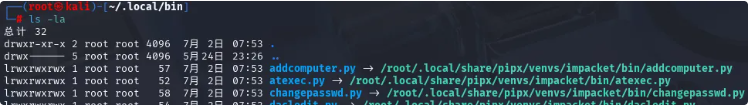
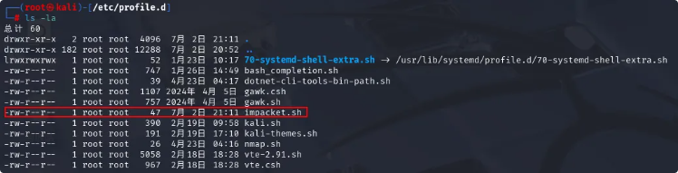
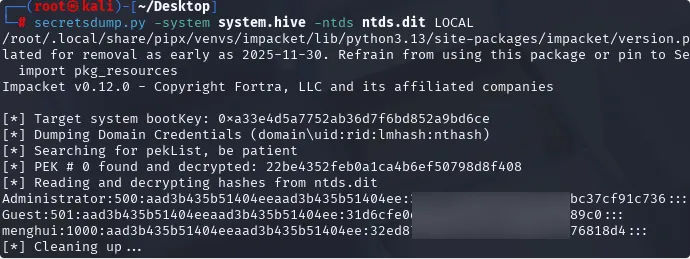

# 系统语言汉化
# APT源修改
# 导入配置历史命令
+ bash配置文件

```shell
# 历史记录保存位置
HISTFILE=~/.bash_history

export HISTSIZE=5000           # 内存中最大保存条数
export HISTFILESIZE=10000      # 历史文件最大条数
export HISTCONTROL=ignoreboth  # 忽略重复命令和空格开头的命令
```

+ zsh配置

```shell
# 历史记录保存位置
HISTFILE=~/.zsh_history

# 内存中保存的历史数量
HISTSIZE=5000

# 历史文件最大记录数
SAVEHIST=10000

# 配置选项 (添加到 .zshrc)
setopt EXTENDED_HISTORY    # 记录时间戳
setopt SHARE_HISTORY       # 实时共享历史
setopt HIST_IGNORE_SPACE   # 忽略空格开头的命令
setopt HIST_IGNORE_DUPS    # 忽略重复命令
setopt INC_APPEND_HISTORY  # 立即写入历史文件
```

# BurpSuite替换为专业版
# 火狐安装BurpSuite证书以及界面汉化
# 下载SecLists、jwt.secrets字典
# 安装多版本JDK并切换
+ 删除原装JDK（原装JDK使用apt安装的）
    - `apt autoremove openjdk-21-jre`
    - `apt autoremove openjdk-21-jre-headless`
+ 准备JDK
    - JDK8：[https://repo.huaweicloud.com/java/jdk/](https://repo.huaweicloud.com/java/jdk/)
    - JDK21：[https://www.oracle.com/cn/java/technologies/downloads/#java21](https://www.oracle.com/cn/java/technologies/downloads/#java21)
+ 在`/usr/lib/jvm/`下创建一个JAVA8文件夹和JAVA21文件夹并将下载的压缩包移动到对应文件夹，然后解压
+ 配置多版本管理工具
    - `update-alternatives --install /usr/bin/java java /usr/lib/jvm/java[8|21]/解压后的目录名/bin/java 1（优先级）`
    - `update-alternatives --install /usr/bin/javac javac /usr/lib/jvm/java[8|21]/解压后的目录名/bin/javac 1（优先级）`
+ 切换JDK版本
    - `update-alternatives --config java`
    - `update-alternatives --config javac`
+ 验证
    - 
    - 

# 可能存在的问题

## PIP安装提示”外部管理环境“

运行命令

```bash
mv /usr/lib/python3.13/EXTERNALLY-MANAGED /usr/lib/python3.13/EXTERNALLY-MANAGED.bak
```

原因

Manjaro、Ubuntu、Fedora 以及其他的最新发行版中，正在使用 Python 包来实现此增强功能。这个更新是为了避免「操作系统包管理器 (如pacman、yum、apt) 和 pip 等特定于 Python 的包管理工具之间的冲突」。这些冲突包括 Python 级 API 不兼容和文件所有权冲突。

#  配置SSH

在`~/.ssh/`创建config文件，添加以下内容以支持旧的ssh算法

```bash
# 可选：全局旧算法支持（适用于所有服务器）
Host *
    HostKeyAlgorithms +ssh-rsa
    PubkeyAcceptedAlgorithms +ssh-rsa
```


#  安装Impacket包

## 压缩包安装

下载压缩包并解压然后进入压缩包目录下的`examples`目录，使用python3运行对应的py文件即可

```bash
python3 wmiexec.py domain/user:password@ip
python3 psexec.py domain/user@ip -hashs :NTLM
```

##  PIP安装

```bash
python3 -m pipx install impacket
```

安装完成后家目录下的`.local/bin/`中会有对应的impacket中py文件的软链接



可选：

将该目录临时加入环境变量，这样就可以使用快捷命令

```bash
export PATH="$PATH:/root/.local/bin"
```

持久化加入环境变量，注销后重新登录就会自动执行脚本加入环境变量，也可以运行`source /etc/profile`命令为当前登录用户运行脚本（推荐）。要卸载的话毫无疑问删除脚本即可

```bash
#在/etc/profile.d/目录下创建一个脚本，脚本内容为以下内容即可
#!/bin/sh
export PATH="$PATH:/root/.local/bin"
```



示例



使用见impacket使用笔记
